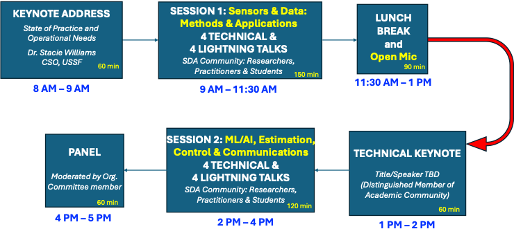

# Detailed Program: ACC 2026 Workshop: Data Driven Methods for Space Resiliency

 
<h2 style="color:rgb(0, 125, 125);">Keynote Address. 8 - 9 AM.</h2> 

 <a href="https://www.spaceforce.mil/DesktopModules/ArticleCS/Print.aspx?PortalId=2&ModuleId=924&Article=3957892"><b>Dr. Stacie Williams</b></a>, Chief Science Officer. United States Space Force.   
<strong>Overview:</strong> Science and technology roadmap of the US Space Force. 

<h2 style="color:rgb(0, 125, 125);">Morning Session: Sensors and Data - Algorithms and Applications. 9 - 11:30 AM.</h2> 

 <a href="https://engineering.purdue.edu/AAE/people/ptProfile?resource_id=111420"><b>Dr. Carolin E. Frueh</b></a>,
  Harold DeGroff Associate Professor of Aeronautics and Astronautics. Purdue University.  
  <strong>Title:</strong> Coming Soon.  
  <strong>Abstract:</strong> Coming Soon.

 <a href="https://www.ae.utexas.edu/people/faculty/faculty-directory/zanetti"><b>Dr. Renato Zanetti</b></a>, Associate Professor. The University of Texas at Austin.  
<strong>Title:</strong> Advances in Ensemble Gaussian Mixture Filtering for Space Object Tracking   
<strong>Abstract:</strong> This presentation explores recent advances in orbital mechanics estimation under sparse and unreliable data conditions, with a focus on nonlinear filtering and data fusion techniques. We introduce enhancements to the Ensemble Gaussian Mixture Filter (EnGMF), a hybrid approach combining particle and Gaussian mixture representations, tailored for systems with strong nonlinear dynamics and nonlinear measurements. A novel deterministic sampling method based on Projected Cramér–von Mises Distance is presented, offering improved accuracy and computational efficiency in high-dimensional filtering problems. Additionally, we discuss kernel-based modifications to the EnGMF for orbit determination in low Earth orbit and Cislunar environments, incorporating bi-fidelity propagation and adaptive particle selection to maintain estimation consistency with limited observations. Finally, we examine the role of posterior-based weight updates in Gaussian mixture filters, demonstrating their superiority over traditional prior-based methods in both single- and multi-target tracking scenarios. These contributions collectively advance the state of the art in space object tracking and estimation under challenging sensing conditions.

 <a href="https://piyushmehta.faculty.wvu.edu/home"><b>Dr. Piyush M. Mehta</b></a>,  Associate Professor and Director of The Center for Innovation in Space Exploration. West Virginia University.  
  <strong>Title:</strong>  Physics- and Data-Driven Space Weather Paradigm for Resilient Operations in (V)LEO.   
  <strong>Abstract:</strong> Operations in very low Earth orbit (VLEO) and low Earth orbit (LEO) are increasingly sensitive to space-weather–driven variability in the ionosphere–thermosphere system, which can produce rapid and poorly predicted changes in atmospheric density and drag. This work proposes a physics- and data-driven space weather paradigm that integrates first-principles modeling, machine learning, and data assimilation to produce uncertainty-aware forecasts of the near-Earth space environment. The framework translates thermospheric and space weather uncertainties into actionable orbital risk metrics for satellite operators. By coupling physical insight with data-driven dynamical system models, the approach enables resilient orbit prediction, maneuver planning, and autonomous operations in the increasingly congested VLEO and LEO regimes under both nominal and storm conditions.

 <a href="https://www.linkedin.com/in/islam-hussein-04359b24/"><b>Dr. Islam Hussein</b></a>,
  Vice President of R&D. Trusted Space, Inc.  
  <strong>Title:</strong> Coming Soon.  
  <strong>Abstract:</strong> Coming Soon.

<figure>
  
  <figcaption>Workshop Timeline</figcaption>
</figure>
